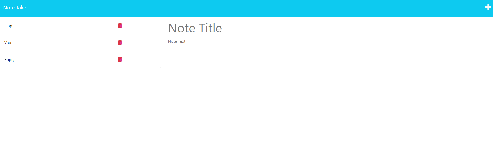

# Express Note Taker

## Description
Welcome to the 'Note Taker' application. Here you will be able to create notes that will be saved into you own 'database'. This application utilizes HTML, Bootstrap, node.js, and express.js. HTML and Bootstrap were used to create the frontend, node.js and express.js were used to create the backend of the project. The backend consists of a server and a 'database' using a json file. There were many challenges that I came across when working on this application. The main challenge was creating routes and modularizing the routes within there own files. Initially, this caused a lot of confusion as I had to match the routes with the index.js of the page. These routes consisted of basic CRUD operations on the database, such as 'get', 'post', and 'delete'. These routes utilized the 'fs' methods within node.js to read and create json files. Another challenge was correctly using the middleware within the server. The middleware, typically called with .use(), brought a lot of confusion. After learning more about middleware, implementing it became a lot easier.
After completing this application, I now understand express.js and server functionality a lot more.

## Installation
Since this application is deployed on Heroku, you do not need to install any extra material.

## Usage
With the landing page, click the button to enter the notes section. Input your notes, then click on the save icon on the top-right section of the page. Your notes will save in the json file and be displayed along the left side of the page. To view the whole note, click on the desired note. To delete a note, click on the trash icon on the note you wish to delete.

## Screenshots

## Links
Github Repo: https://github.com/bear-muna/express-note-taker

Heroku Deployed Site: https://bear-express-note-taker.herokuapp.com/